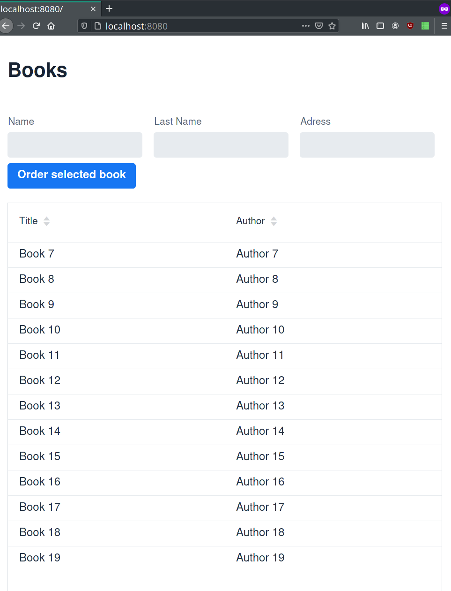
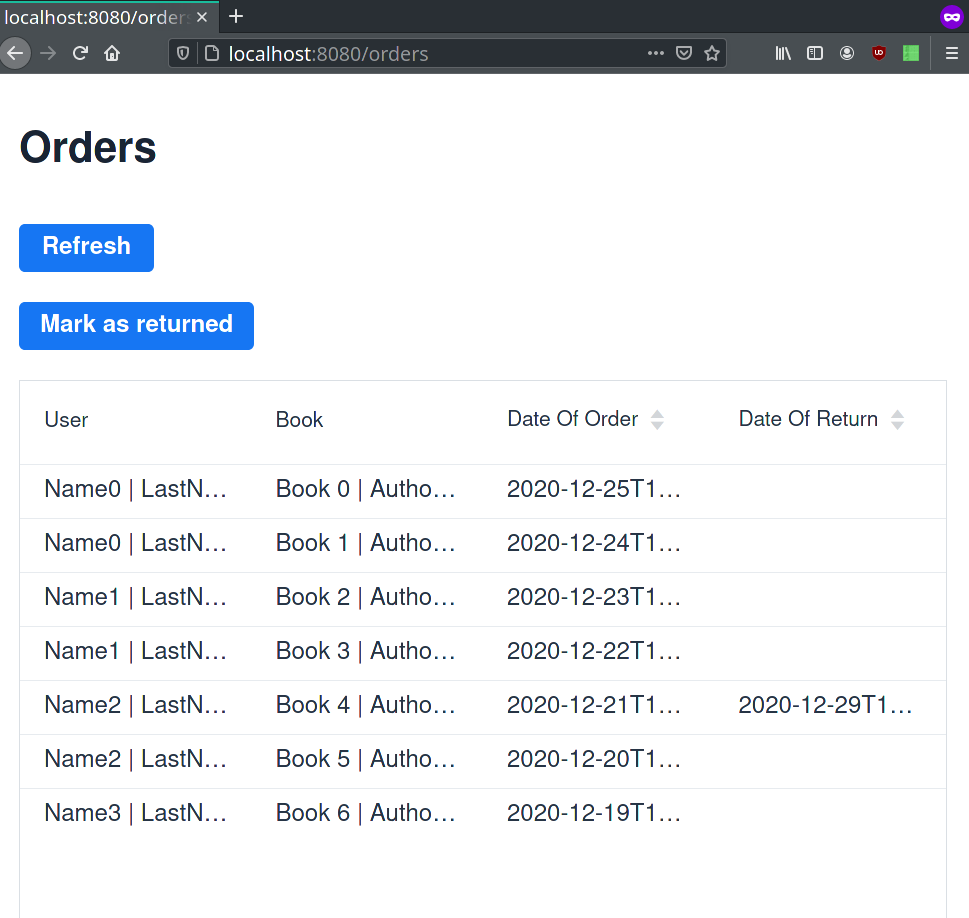
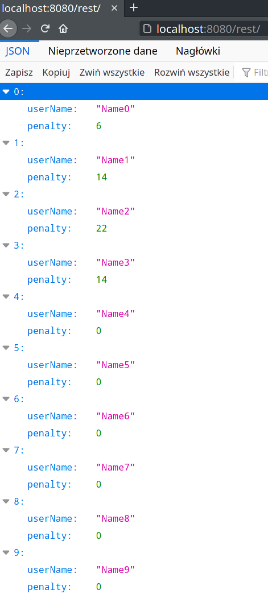

Created in 06.2020. As an exam we had to create a simple web app for e-library. This app uses spring boot with vaadin. People can order books by giving their details and selecting a book. There is a view for library employees where all orders are shown and orders can be marked as returned. There is also a REST route where penalties for each user are shown (if book wasn't returned in 3 days then 2PLN for each next day).

### User view

### Orders

### REST

